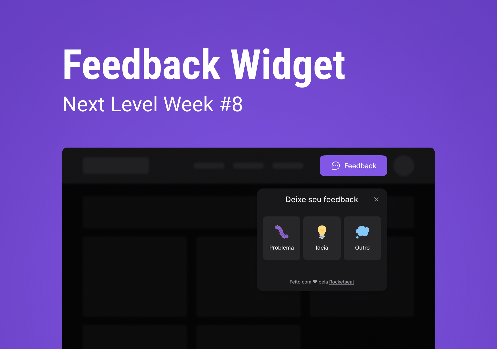
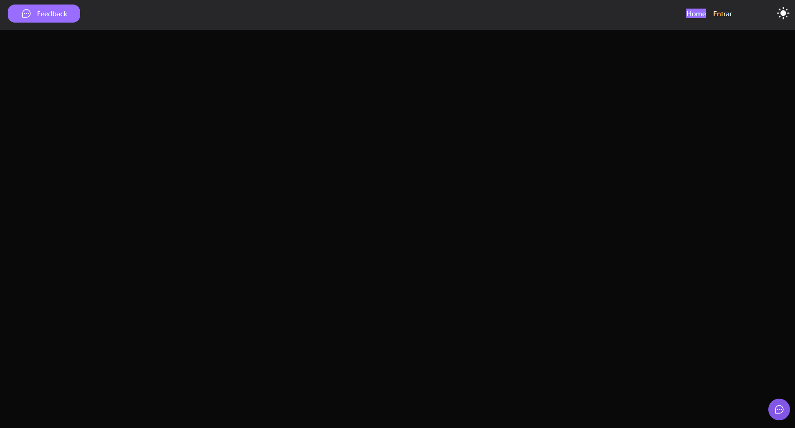
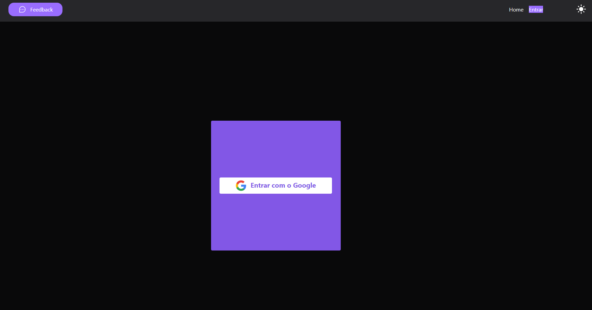

# Feedback Widget

## :computer: Sobre o Projeto

Feedback Widget é um aplicação web que possibilita o envio de feebacks, além de tirar um screenshot da tela para envio.

O usuário pode enviar um feedback do tipo: Problema, Ideia ou Outro.

A aplicação apresenta um layout em tema dark e light, basta o usuário clicar no ícone no canto superior direito.

A aplicação possui um sistema de autenticação, onde os usuários podem realizar o login através de uma conta do Google.

<p align="center"><em>Confira o resultado em: <a href="https://nlw-return-8-vitor.vercel.app/" target="_blank">nlw-return-8-vitor.vercel.app</a></em></p>

## Layout

<div>
  
</div>

## Imagens

<div>
  
  
</div>

## :rocket: Techs

<ul>
  <li> Tailwind CSS </li>
  <li> Headless UI </li>
  <li> ReactJS </li>
  <li> Express </li>
  <li> React Native </li>
  <li> Firebase </li>
  <li> Vite </li>
</ul>

## Desenvolvimento

---

### Pré-requisitos

- Instalar [Node.js](https://nodejs.org)

### Clone o repositório

```bash
$ git clone git@github.com:vitorgaletti/nlw-return-8.git
```

### Executar Projeto

#### Front-End

```bash
# Mudar para directório
$ cd nlw-return-8/
```

```bash
# Mudar para directório
$ cd web/
```

- Instalar dependências

```bash
$ npm install
```

- Execute

```bash
$ npm run dev
```

- Executar scripts

|           Ação            |   Utilização    |
| :-----------------------: | :-------------: |
| Iniciar o desenvolvimento |  `npm run dev`  |
|  Compilar para produção   | `npm run build` |

<br />

#### Back-End

```bash
# Mudar para directório
$ cd nlw-return-8/
```

```bash
# Mudar para directório
$ cd server/
```

- Instalar dependências

```bash
$ npm install
```

- Execute

```bash
$ npm run dev
```

- Executar scripts

|           Ação            |   Utilização    |
| :-----------------------: | :-------------: |
| Iniciar o desenvolvimento |  `npm run dev`  |
|  Compilar para produção   | `npm run build` |
|      Iniciar testes       | `npm run test`  |

<br />

#### Mobile

```bash
# Mudar para directório
$ cd nlw-return-8/
```

```bash
# Mudar para directório
$ cd mobile/
```

- Instalar dependências

```bash
$ npm install
```

- Execute

```bash
$ npm run dev
```

- Executar scripts

|           Ação            |  Utilização   |
| :-----------------------: | :-----------: |
| Iniciar o desenvolvimento | `npm run dev` |

## Autor

- [@vitorgaletti](https://github.com/vitorgaletti)
